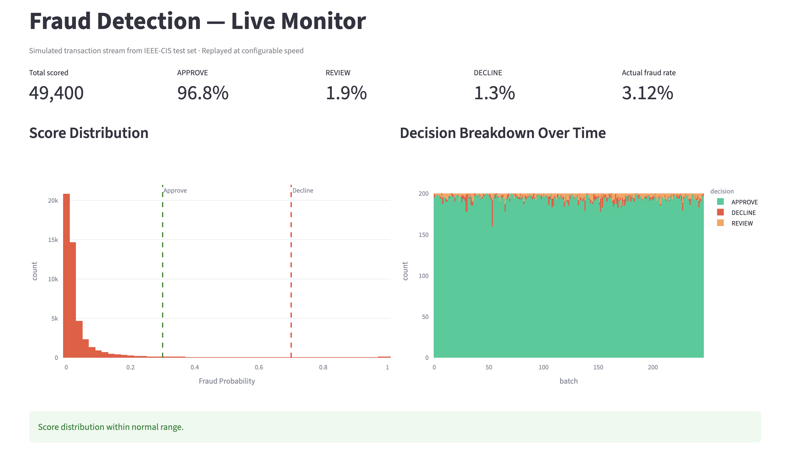
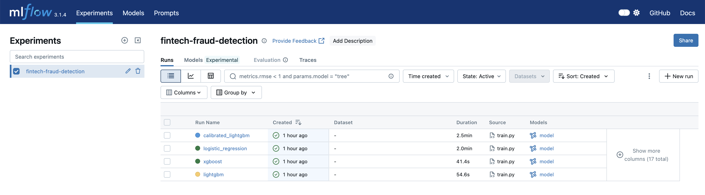

# fintech-fraud-pipeline

Most fraud ML projects end at a notebook with a ROC-AUC score. This one ends with a deployed scoring API, a serialised feature pipeline that's consistent between training and inference, and a monitoring dashboard that detects score drift. Built on the IEEE-CIS dataset — 590k transactions, 3.5% fraud rate.

**Champion model:** LightGBM — PR-AUC 0.487 (test), F1 0.478, ROC-AUC 0.880

---

## Architecture

```
┌─────────────────────────────────────────────────────────────────────┐
│                      fintech-fraud-pipeline                         │
│                                                                     │
│  ┌──────────────┐    ┌───────────────┐    ┌─────────────────────┐  │
│  │  Ingestion   │───▶│   Features    │───▶│  Training + MLflow  │  │
│  │              │    │               │    │                     │  │
│  │ CSV→Parquet  │    │ Encoders      │    │ LightGBM / XGBoost  │  │
│  │ Schema check │    │ Time features │    │ LogReg / Calibrated │  │
│  │ Null rates   │    │ Velocity      │    │ PR-AUC primary      │  │
│  └──────────────┘    └───────────────┘    └──────────┬──────────┘  │
│                                                       │             │
│                                              champion model         │
│                                              + encoders.pkl         │
│                                                       │             │
│                                           ┌───────────▼─────────┐  │
│                                           │  FastAPI            │  │
│                                           │  POST /predict      │  │
│                                           │  GET  /health       │  │
│                                           │  GET  /metrics      │  │
│                                           └───────────┬─────────┘  │
│                                                       │             │
│                                           ┌───────────▼─────────┐  │
│                                           │  Streamlit Monitor  │  │
│                                           │  Score distribution │  │
│                                           │  Drift detection    │  │
│                                           │  Decision breakdown │  │
│                                           └─────────────────────┘  │
│                                                                     │
│  PostgreSQL · MLflow tracking · Docker Compose                      │
└─────────────────────────────────────────────────────────────────────┘
```

---

## Screenshots

**Monitoring dashboard — live simulation with drift injection:**



**MLflow experiment tracking — 4 model runs compared:**



---

## What this demonstrates

- **Full ML lifecycle** — raw CSV through to a deployed, monitored scoring API
- **Production thinking** — serialised feature pipelines, time-aware splits, threshold-based decisioning, Prometheus metrics
- **Fraud-specific engineering** — SMOTE for class imbalance, target encoding for high-cardinality fields, null indicators for informative missingness, temporal leakage prevention
- **Clean, deployable code** — Docker Compose, Makefile, pytest suite, environment config

---

## Quick start

**1. Get the data**

Download from [Kaggle](https://www.kaggle.com/c/ieee-fraud-detection/data) and place in `data/raw/`:
```
data/raw/train_transaction.csv
data/raw/train_identity.csv
```

**2. Set up the environment**

```bash
make setup
cp .env.example .env
```

**3. Run the full pipeline**

```bash
make ingest       # CSV → Parquet
make train        # train 4 models, log to MLflow, save champion
make serve        # FastAPI at http://localhost:8000
make dashboard    # Streamlit at http://localhost:8501
```

**Or start everything with Docker:**

```bash
make up
```

---

## API usage

```bash
curl -s -X POST http://localhost:8000/predict \
  -H "Content-Type: application/json" \
  -d '{"TransactionAmt": 149.50, "ProductCD": "W", "card1": 9500, "card4": "visa", "P_emaildomain": "gmail.com"}'
```

```json
{
  "fraud_probability": 0.851,
  "decision": "DECLINE",
  "model_version": "dd82de32",
  "threshold_approve": 0.3,
  "threshold_decline": 0.7
}
```

Decisions are threshold-based — `APPROVE < 0.3 < REVIEW < 0.7 < DECLINE`. Thresholds are env vars, not model parameters. A product manager can adjust the risk appetite without retraining.

Interactive API docs: http://localhost:8000/docs

---

## Model results

Trained on 590,540 transactions with a time-aware split (no shuffle — prevents temporal leakage).

| Model | Val PR-AUC | Test PR-AUC | Test ROC-AUC | Test F1 |
|---|---|---|---|---|
| **LightGBM** ✓ | **0.528** | **0.487** | **0.880** | **0.478** |
| XGBoost | ~0.43 | ~0.42 | ~0.87 | ~0.44 |
| Calibrated LightGBM | ~0.43 | ~0.42 | ~0.87 | ~0.43 |
| Logistic Regression | ~0.23 | ~0.22 | ~0.79 | ~0.31 |

Random baseline PR-AUC = 0.035 (the fraud rate). LightGBM is **14x better than random**.

The LR gap (0.49 vs 0.23) demonstrates that fraud patterns are non-linear — a linear decision boundary misses the interactions between card velocity, email domain, and transaction amount that tree models capture.

---

## Services

| Service | URL | Description |
|---|---|---|
| FastAPI | http://localhost:8000 | Fraud scoring endpoint |
| API Docs | http://localhost:8000/docs | OpenAPI spec |
| MLflow UI | http://localhost:5001 | Experiment tracking |
| Streamlit | http://localhost:8501 | Monitoring dashboard |

---

## Tech stack

| Layer | Technology |
|---|---|
| Data processing | Python, Pandas, Polars, PyArrow |
| ML | LightGBM, XGBoost, scikit-learn, imbalanced-learn |
| Experiment tracking | MLflow |
| API | FastAPI + Pydantic |
| Monitoring | Streamlit + Plotly |
| Storage | Parquet + PostgreSQL |
| Containers | Docker + Docker Compose |
| Testing | pytest |

---

## Key engineering decisions

**Why Parquet?** Columnar format, schema-enforced, ~70% smaller than CSV. All intermediate data is Parquet.

**Why time-aware split?** Random splitting leaks future transaction patterns into training. We split on `TransactionDT` order: train on early data, validate on later data.

**Why serialize the feature pipeline?** The same `encoders.pkl` used at training time is loaded at serving time. This prevents training/serving skew — the most common source of silent model degradation in production.

**Why threshold-based decisions?** Separates the model output (probability) from the business decision (threshold). Thresholds are environment variables, adjustable without retraining.

---

## Running tests

```bash
make test
```

---

## Deploy to GCP

See [docs/deploy_gcp.md](docs/deploy_gcp.md) for a full Cloud Run deployment guide (~$7/month).

---

## Dataset

[IEEE-CIS Fraud Detection](https://www.kaggle.com/c/ieee-fraud-detection) — 590,540 transactions, ~3.5% fraud rate.
See [docs/dataset_notes.md](docs/dataset_notes.md) for engineering gotchas specific to this dataset.

---

## Author

Anas Abughazaleh · [LinkedIn](https://www.linkedin.com/in/anas-abughazaleh/) · [GitHub](https://github.com/anasag)
